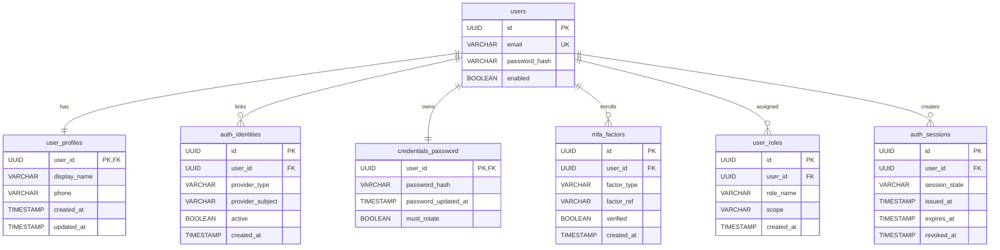

# Database Architecture (Identity Service)

This folder contains database assets for local development and Aurora-compatible deployments.

## What changed so far

- Register/login now persist user records in PostgreSQL.
- Schema evolution is managed via Liquibase scripts.
- Liquibase scripts are located under `database/liquibase`.
- Aurora provisioning support includes role/grant scripts under `database/aurora`.

## Folder layout

- `database/liquibase/` - schema changelogs and versioned DDL changesets
- `database/aurora/` - Aurora runbook and grant bootstrap SQL

## Liquibase scripts

- Master changelog: `database/liquibase/db.changelog-master.yaml`
- Changesets:
  - `database/liquibase/changes/001-create-users-table.yaml`
  - `database/liquibase/changes/002-add-users-indexes.yaml`

All current changesets use `author: sydlab`.

## Current schema (implemented)

The current implementation persists authentication users in a single table:

- `users`
  - `id` (UUID, PK)
  - `email` (VARCHAR(255), unique, required)
  - `password_hash` (VARCHAR(255), required)
  - `enabled` (BOOLEAN, required)

## ER diagram (current + extension-ready)

## Extensibility guidance

- Keep `users` as the stable identity anchor.
- Add new authentication/security capabilities in separate tables and changesets.
- Prefer additive migrations (new tables/columns/indexes) over destructive changes.
- Preserve current API behavior while expanding capabilities (MFA, social login, SSO, passwordless, token/session models).

## Local and runtime behavior

- Spring config points Liquibase at `file:database/liquibase/db.changelog-master.yaml`.
- Local dev/test execution should run from repository root so file-based changelog resolution works.
- For Aurora environment setup, follow `database/aurora/README.md`.
