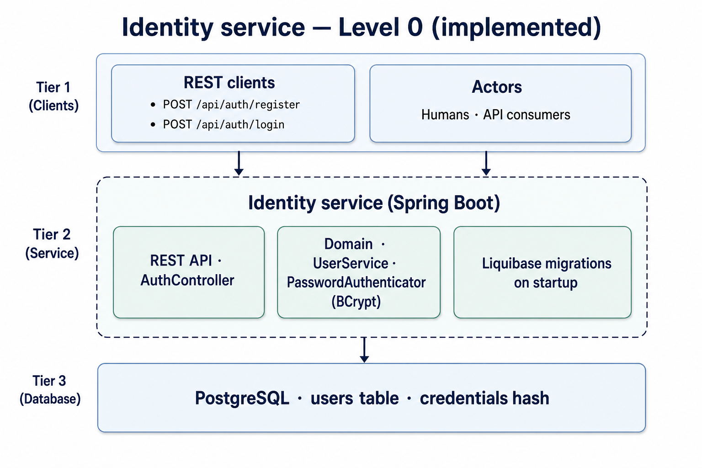
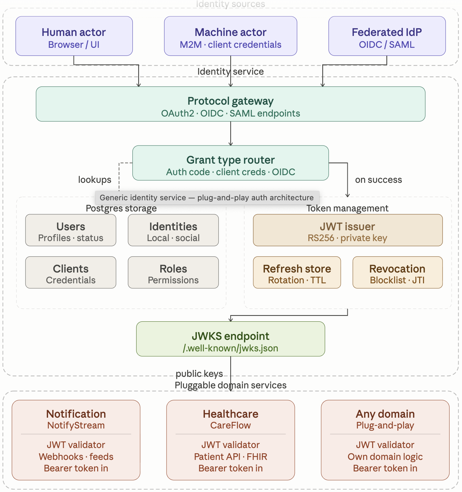

# Identity service — documentation

Implementation runbooks and API examples stay in the [root README](../README.md).

## Diagrams

| | |
|--|--|
| **Level 0 (implemented)** — password register/login, Spring Boot, Liquibase, PostgreSQL |  |
| **Future platform (roadmap)** — OAuth2/OIDC/SAML, JWT, JWKS, clients, domains (not implemented) |  |

## Articles

| Doc | Contents |
|-----|----------|
| [Overview](overview.md) | Goals, what is in scope today vs later |
| [Application architecture](application-architecture.md) | Layers, flows, security, errors, `Authenticator` seam |
| [Data and operations](data-and-operations.md) | Schema, Liquibase, profiles, Docker |
| [Release process](RELEASE.md) | `dev` → `main`, SemVer tags, GitHub Releases |
| [Roadmap](ROADMAP.md) | Shipped vs planned work, issue links, project board |
