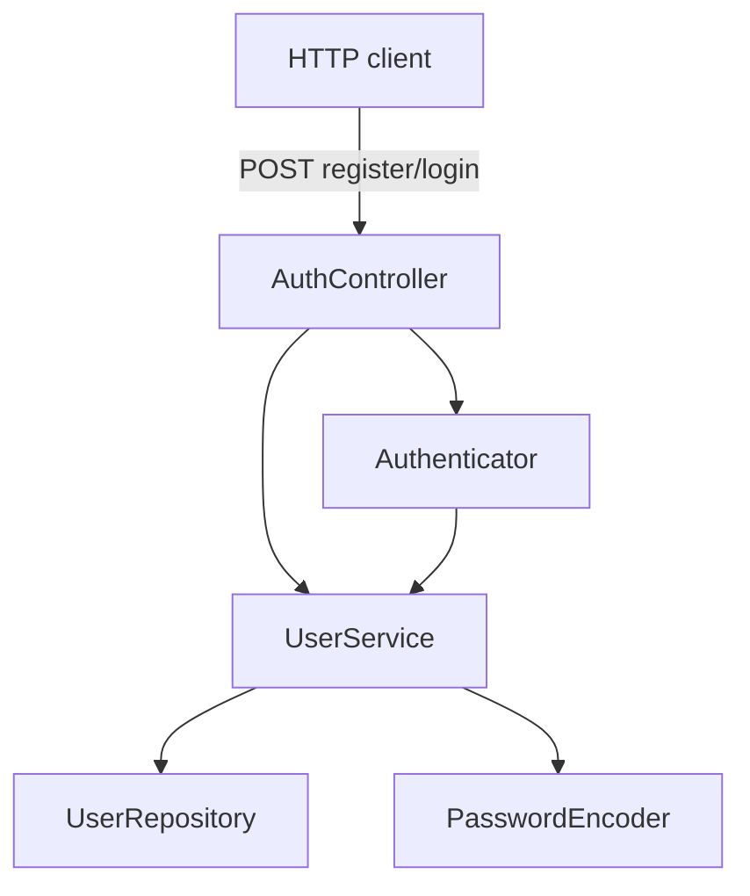
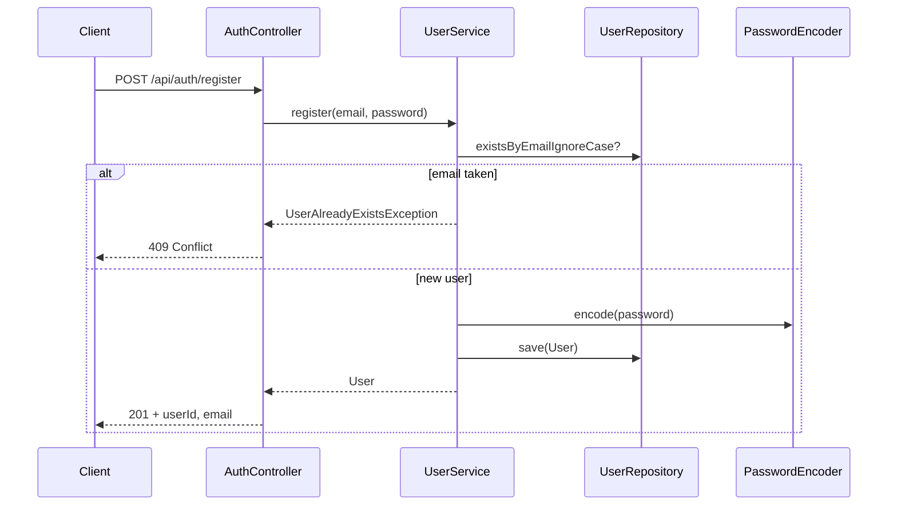
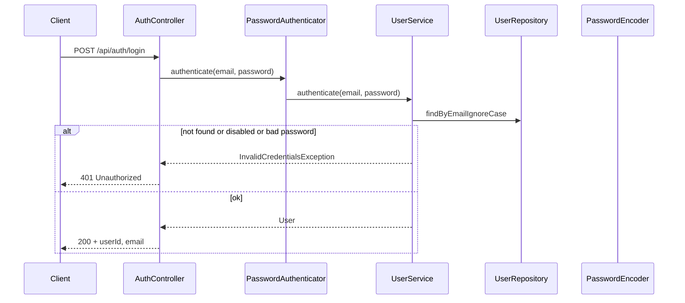

# Application architecture

## Layering

The codebase follows a simple layered style:

| Layer | Package | Responsibility |
|-------|---------|----------------|
| HTTP | `com.example.identity.auth` | REST DTOs, `AuthController` |
| Domain / application | `com.example.identity.user` | `UserService`, orchestration, transactions |
| Persistence | `com.example.identity.user` | JPA `User`, `UserRepository` |
| Cross-cutting | `com.example.identity.config` | `SecurityFilterChain`, `PasswordEncoder` bean |
| API errors | `com.example.identity.web` | `ApiExceptionHandler` (`@RestControllerAdvice`) |

`PasswordAuthenticator` lives in `auth` and delegates to `UserService` so the controller depends on **`Authenticator`**, not on transport-agnostic orchestration directly.

## Registration flow

## Login flow

## Security configuration

Spring Security:

- **`/api/auth/**`** is permitted without authentication (stateless, no session, CSRF disabled for this JSON API surface).
- **Everything else** requires authentication — today most traffic is auth endpoints; additional routes remain protected by default.

Passwords are never returned in responses; only a hash is stored (`password_hash` column).

## Error contract

Domain exceptions map to HTTP status in **`ApiExceptionHandler`**:

| Exception | HTTP | Typical `message` |
|-----------|------|-------------------|
| `UserAlreadyExistsException` | 409 | User already exists with this email |
| `InvalidCredentialsException` | 401 | Invalid credentials |
| `MethodArgumentNotValidException` | 400 | Validation failed (+ `details` field errors) |

## Extension seam: Authenticator

New credential checks (MFA steps, federation, magic links) should:

1. Implement `Authenticator` (or a richer interface layered on it).
2. Wire the bean used by `AuthController` without changing repository contracts unnecessarily.
3. Add tests parallel to existing integration and unit tests.
